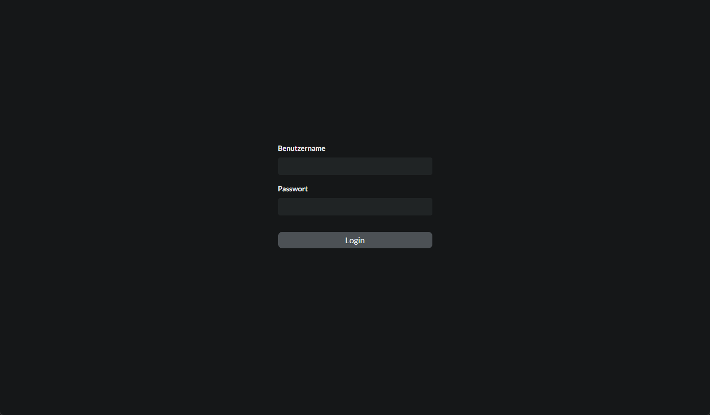
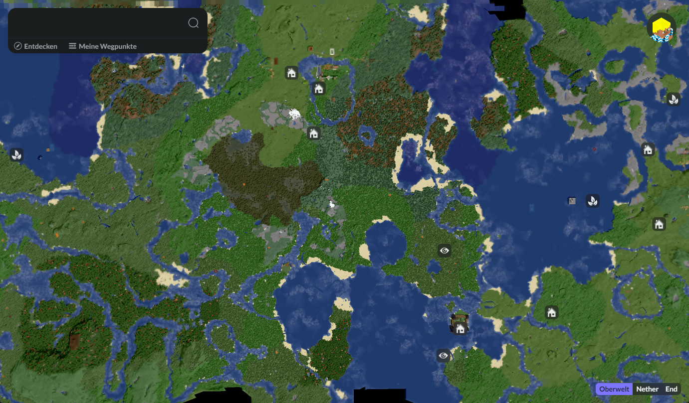

# BMS - The Minecraft Companion App

This repository contains the source code of the the web-based companion app for our survival multi-player Minecraft server. The main feature is a 3D rendered map of the Minecraft world.

Furthermore, the app features a waypoint system. Logged-in players can

- create their own waypoints and categorize them.
- set the visibility of their own waypoints, i.e. make them private, public or only visible to a selection of players
- discover other players waypoints by filtering or searching
  The waypoints are fully integrated into the map and changes to public waypoints are **streamed in real-time** to other players currently connected to the web-app.

## Screenshots and Videos

### Authentication

### Overview

### Discover waypoints by filterung and searching

<video src="assets/waypoint.mp4" controls title=""></video>
